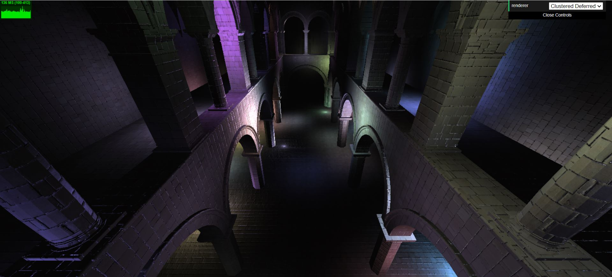
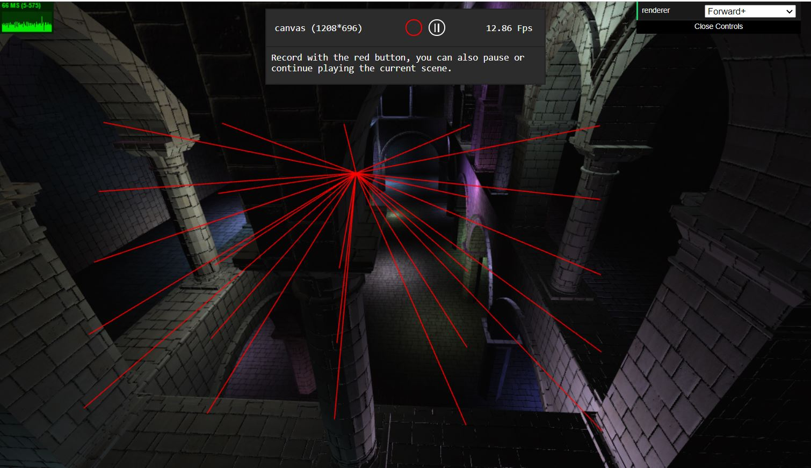
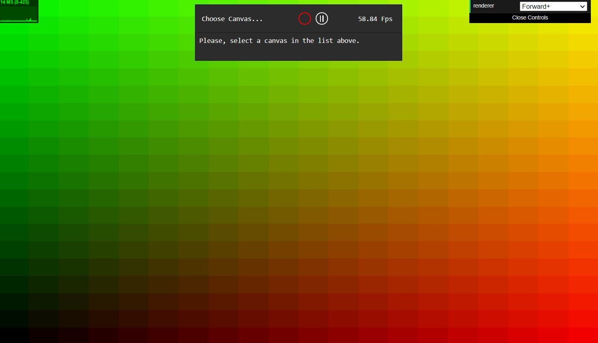
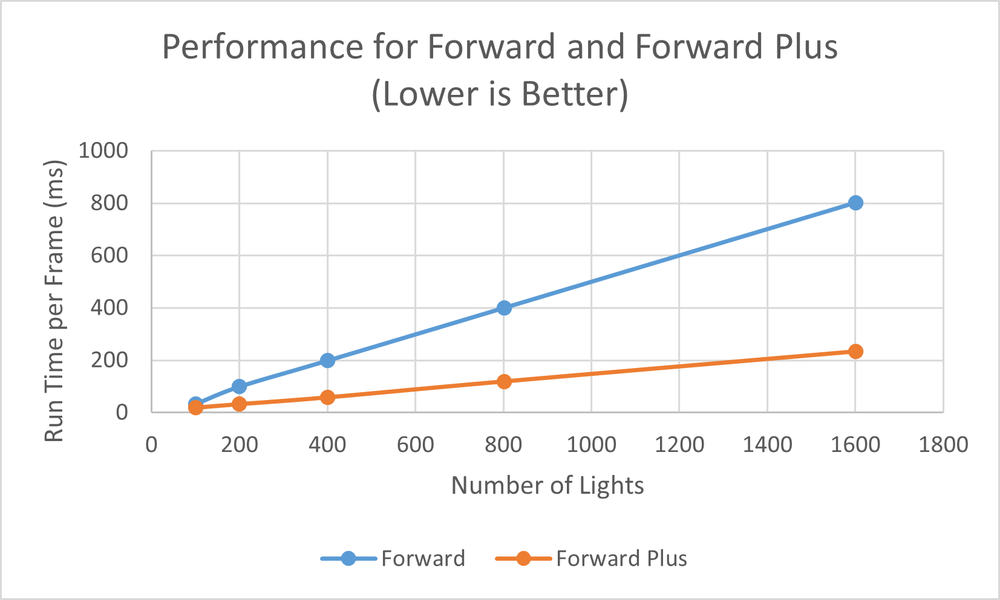
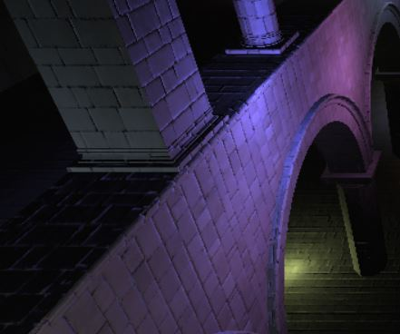
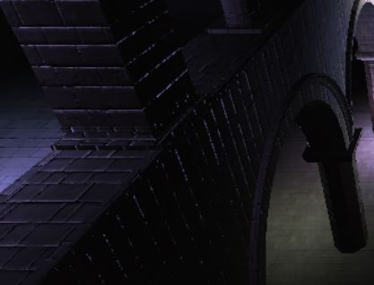
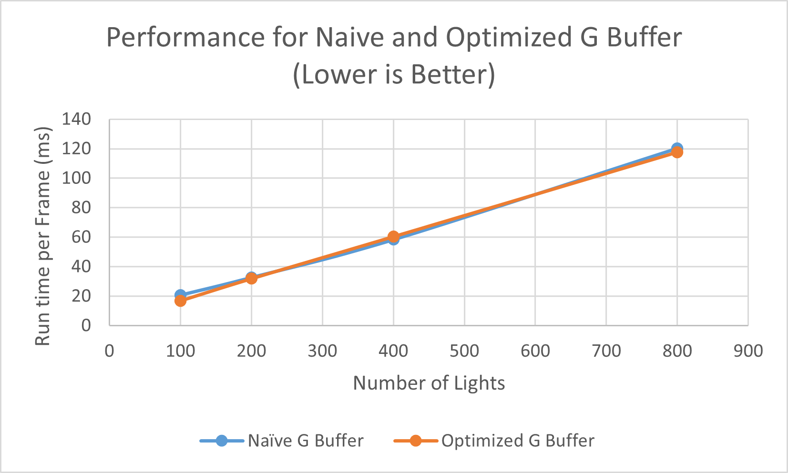
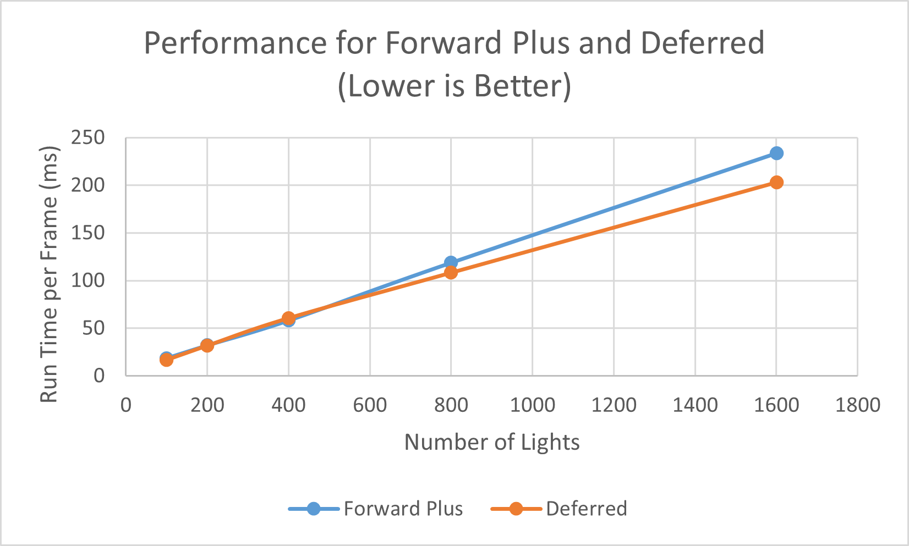
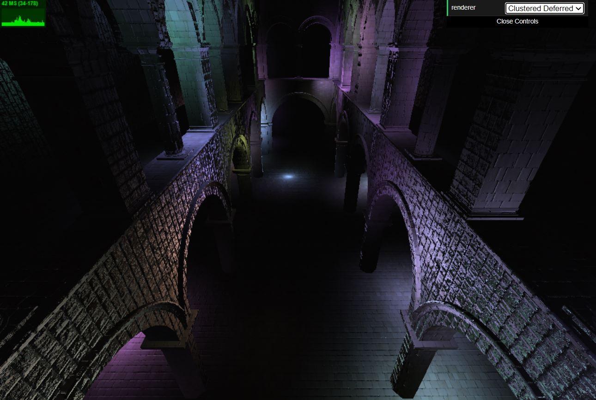

WebGL Forward+ and Clustered Deferred Shading
======================

**University of Pennsylvania, CIS 565: GPU Programming and Architecture, Project 5**

* Yuxuan Zhu
  * [LinkedIn](https://www.linkedin.com/in/andrewyxzhu/)
* Tested on: Windows 10, i7-7700HQ @ 2.80GHz 16GB, GTX 1050 4096MB (Personal Laptop)

### Live Online

### Demo Video/GIF

[]

### Introduction

I implemented forward plus rendering and deferred rendering with clustered lights. By creating sub-frustums from the orginigal viewing frustum, we can cluster lights based on their location and region of effect. This reduces the amount of time required to computing lighting as the number of lights scale up. I also implemented Blinn Phong reflection model for the deferred shading renderer. I further reduced the number of G Buffers used in deferred shader down to 2 by packing values. 

### Performance Analysis

## Clustered Lights

I clustered the lights by the different viewing subfrustum they belong to. The image below is a demonstration of how the viewing frustum is divided. 

A 2-D camera space view of the division is shown below.

Clustering lights reduces the number of lights each fragment need to check to compute lighting effects. Using clustered lights, each fragment only need to check the lights in the cluster it belongs to. This reduces the amount of time required to computing lighting as the number of lights scale up. To compute which cluster the lights belong to, instead of naively iterating through all the frustums and all the lights, I iterated through the lights and found the regions of clusters where the lights could belong to. Then I calculated whether the light intersects with these clusters. It may not be necessary to perform this intersection step since the region of clusters is already a subset of the entire viewing frustum. The performance comparison is shown below. Forward plus uses clustered lights. If I have more time, I could calculate the sub frustums once at the beginning of rendering and store them for use later. This could be done because the sub frustum will be the same size and location in camera space for the whole duration.

## Bling Phong Reflection

Bling Phong is a commonly used shading model to simulate diffuse and specular reflection for lights. It performs additional specular reflection for each fragment, so it will slow down the run time of the shaders, but it will be a visual improvement. As the number of lights increase, the run time will increase at a linear rate. This is standard calculation, so there's not much room for improvement.

Original |  Bling Phong
:-------------------------:|:-------------------------:
  |  

## Reducing G-Buffers

Deferred shading requires storing information such as fragment position, fragment color and fragment normal in G buffers. A naive implementation would use three buffers to store the three vec3s. However, since each buffer by default stores a vec4 at each pixel, we can pack the information together to reduce the number of buffers required. Further, since normal vectors are unit vectors, we can store them as a pair of theta, phi spherical coordinates as opposed to 3 dimensional Euclidean coordinates. Thus we need 3 + 3 + 2 = 8 = 4 * 2 floats to store the required information for each pixel. We can thus cut down the number of buffers required from 3 to 2. This reduces the amount of memory used. However, I did not find much performance improvement as a result of this, as shown below. I could further reduce the number of Gbuffers required by reconstructing fragment position from it's x/y/z and camera matrices. However, this requires unnecessary extra computation so I decided not to pursue. 

## Forward Plus vs Deferred 

In addition to forward plus, I also implemented deferred clustered rendering. Deferred rendering is well suited for complex scenes with lots of objects. It only renders the scene once and the lighting computation does not depend on the complexity of the scene. However, it uses extra memory to store the G bufferes. Furthermore, in comparison, Forward plus can handle situations like translucent materials, while deferred shading cannot. There is not much difference in performance in my implementation of the forward plus and deferred rendering algorithms, as shown below. This is because both are using clustered lights. 

### Bloopers

I got this cool effect with incorrect normal calculation

### Credits

* [Three.js](https://github.com/mrdoob/three.js) by [@mrdoob](https://github.com/mrdoob) and contributors
* [stats.js](https://github.com/mrdoob/stats.js) by [@mrdoob](https://github.com/mrdoob) and contributors
* [webgl-debug](https://github.com/KhronosGroup/WebGLDeveloperTools) by Khronos Group Inc.
* [glMatrix](https://github.com/toji/gl-matrix) by [@toji](https://github.com/toji) and contributors
* [minimal-gltf-loader](https://github.com/shrekshao/minimal-gltf-loader) by [@shrekshao](https://github.com/shrekshao)
* [Blinn-Phong](https://en.wikipedia.org/wiki/Blinn%E2%80%93Phong_reflection_model)
