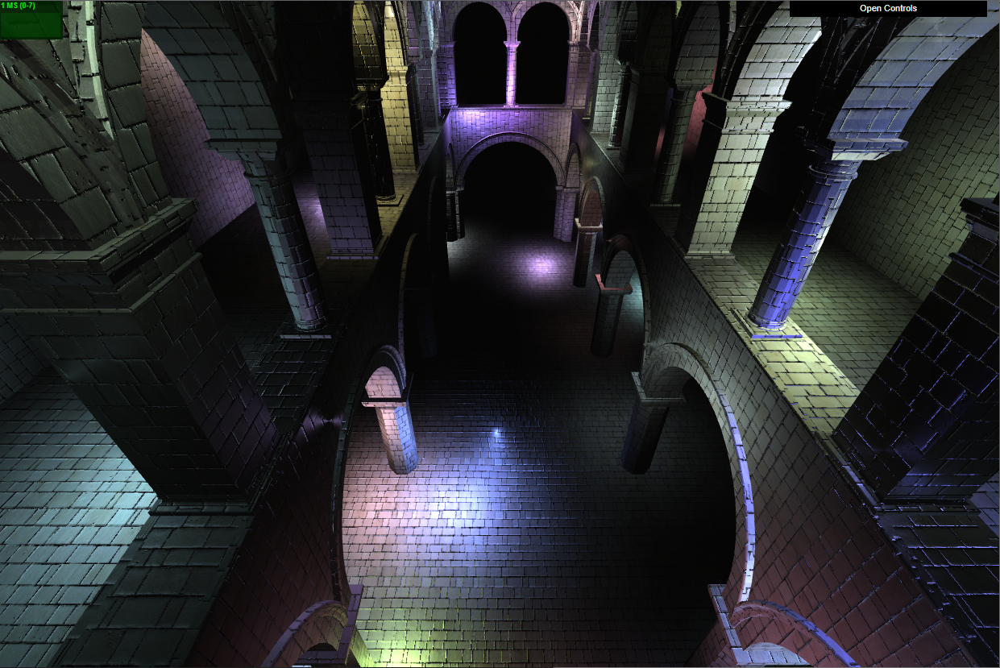
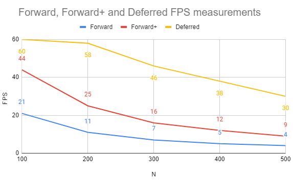
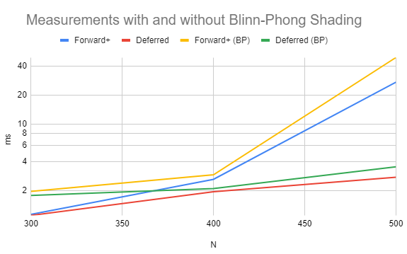
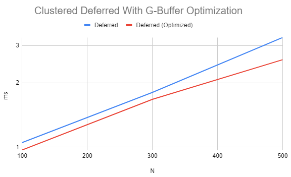

WebGL Forward+ and Clustered Deferred Shading
======================

**University of Pennsylvania, CIS 565: GPU Programming and Architecture, Project 5**

* Kaan Erdogmus
  * [LinkedIn](https://linkedin.com/in/kaanberk), [personal website](https://kaan9.github.io)
* Tested on: **Google Chrome 96.0.4664.110** on 
   Windows 10, i7-8850H @ 2.592GHz 24GB, Quadro P1000

### Live Online

### Demo GIF

## Project Overview
This project simulates a scene with a large number of light sources using different methods of rendering light.
The methods implemented are Forward Rendering, Forward+ Rendering, and Clustered Deferred Rendering.

## Features Implemented
* Rendering
  * Forward+ Rendering
  * Clustered Deferred Rendering
* Effects
  * Blinn-Phong shading for point lights
* Optimizations
  * G-Buffer optimization uses 2-component normals and packs values into vec4s

#### Forward Rendering
Forward rendering iterates over each pixel and for each pixel, iterates over each light to check if that light
affects the color of the pixel. This is rather inefficient as a number of unnecessary checks are performed.

#### Forward+ Rendering
Forward+ rendering improves on Forward rendering by splitting the scene into clusters (with respect to the camera's
3-D view) and associating the lights with the clusters they can affect. Then, when shading the pixels, each pixel
need only be compared against lights of the clusters it can be affected by which significantly 
reduces the number of unnecessary checks.

#### Clustered Deferred Rendering
In clustered deferred shading, object information such as position, color, and normals are stored in geometry buffers.
Then, in the fragment shader, each pixe,l mapped to its data in the g-buffer, is compared with the relevant lights. By further adding clustering, we can check each pixel of the g-buffer against far fewer lights in the scene.

#### Blinn-Phong shading
Blinn-Phong shading imitates specular effects seen on certain materials that reflect and diffuse. By using the
position of the fragment in 3d-space with respect to the camera and the light source, and its surface normal,
we can simulate a specular effect and include it in the overall shading of the fragment.

#### G-Buffer Optimization
The geometry buffers used in Clustered Deferred Rendering can be optimized in several ways. This project optimized the
g-buffers by packing values into vec4s and by using only 2 components to represent a 3-dimensional normal.

In the case of the normal vectors, only the direction is of interest so we can normalize the vector and discard one of
the components when storing the normal. As the sum of squares of the components are 1, we can recover the discarded
normal in the fragment shader. Then, we can pack the two vec4s that contain the position and color vectors (each of
three elements) by using the fourth indices to store the normal's two components.

## Performance Analysis

### Comparing Forward, Forward+, and Clustered Deferred

The measurements shown above are taken with optimization and effects turned off. The
measurements are taken by waiting for the FPS to stabilize then averaging 3 consecutive values if there is still some variation.

The chart clearly demonstrates that the Clustered-Deferred algorithm is faster and
remains fast in comparison as the number of light sources are increased. Note that
the FPS measurements are capped at 60 FPS so the actual performance of Clustered-Deferred for `N = 100` is likely higher.

The Forward+ algorithm outperformed the Forward algorithm as expected since it checks each
fragment only against the lights in nearby clusters whereas the Forward
algorithm checks against a much larger number of lights per pixel.

The Clustered-Deferred algorithm also outperformed the Forward+ algorithm, showing
the added efficiency of the geometry buffers over the Forward+ algorithm, even without g-buffer optimizations. As such, on this machine, the Clustered-Deferred
algorithm is the most suitable for any workload and has the greatest benefits. The
not perfectly efficient memory-packing of the unoptimized Cluster-Deferred likely
has a reduction in performance (analyzed later explicitly) but still dominates
over the other renderings. 

Note that when taking the measurements above, the MAX_LIGHTS_PER_CLUSTER variable
was also altered to be closer to N. When it is significantly smaller, the frustrums'
inaccurate encapsulation of the lights becomes visible and artifacts appear in the frameBuffer. Furthermore, this variable does not appear to have a significant
impact on performance for large N as, when it was kept at 100 while raising N to 
500, the Forward+ and Deferred FPS measurements remained at around 10 FPS and 30 FPS
respectively, same as when it is kept the same as N.

### Blinn-Phong Shading

The above graphs's measurements were made by timing the render function and averaging four consecutive data-points in the case of large variance in samples.

The addition of the Blinn-Phong shader results in a small perfomance decrease in
both the Forward+ and the Clustered-Deferred case.

Even without the effect of this feature, Forward+ and Deferred begin to rapidly
diverge (when measured in milliseconds) at `N = 500`. The effect of the Blinn-Phong
shader is clearly visible in this case, and its contribution appears to roughly grow linearly with N. Although it is certainly significant, it is not the factor
that determines the overall efficiency of the algorithm.

As a potential future optimization, note that the Blinn-Phong shader's specular intensity depends only on the position of the 
camera, the light, and the surface normal (of the relevant fragment).
As such, it might be possible to compute the intensities beforehand, without
invoking shaders that operate on other fragment data. If invoked beforehand (and possibly if there is a way to cache the computations), the shader could be further
optimized beyond the current implementation. 

### G-Buffer Optimization
As described above, this optimization reduces the number of `vec4`s needed for the
g-buffer from 3 to 2 by using only 2-components for the normal and packing the
normal data into the other two `vec4`s.

With the g-buffer optimization, there is a small but distinct performance gain for the Deferred algorithm across a wide range of the number of lights. From the chart,
the best case scenario for a performance improvement appears to be when there are a large number of lights, possibly because the reduction in memory of the g-buffer optimization becomes more significant with greater memory usage. However, the benefits of the optimization between small and large N might be too small to be
significant in the general case.

One tradeoff for this optimization is that it requires additional compute since
mapping and unmapping between 3 and 2 components for the normal as well as
packing and unpacking `vec4`s are not free operation. This optimization trades away
computation in exchange for reduced memory usage.

### Credits

* [Three.js](https://github.com/mrdoob/three.js) by [@mrdoob](https://github.com/mrdoob) and contributors
* [stats.js](https://github.com/mrdoob/stats.js) by [@mrdoob](https://github.com/mrdoob) and contributors
* [webgl-debug](https://github.com/KhronosGroup/WebGLDeveloperTools) by Khronos Group Inc.
* [glMatrix](https://github.com/toji/gl-matrix) by [@toji](https://github.com/toji) and contributors
* [minimal-gltf-loader](https://github.com/shrekshao/minimal-gltf-loader) by [@shrekshao](https://github.com/shrekshao)
* [Reference for Blinn-Phong](https://www.cis.upenn.edu/~cis460/21fa/hw/hw04/openglFun.html)
