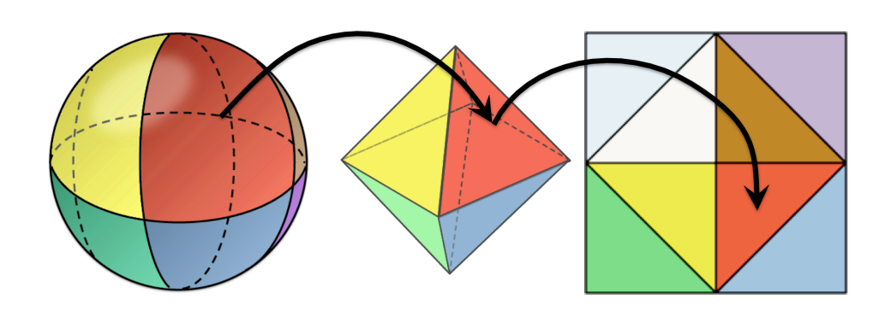

WebGL Forward+ and Clustered Deferred Shading
======================

**University of Pennsylvania, CIS 565: GPU Programming and Architecture, Project 5**

* Bowen Deng
  * [LinkedIn](www.linkedin.com/in/bowen-deng-7dbw13)
* Tested on: Windows 10, AMD Ryzen 9 5900HX with Radeon Graphics @ 3.30GHz 16GB, GeForce RTX 3070 Laptop GPU 8GB (Personal Computer)

## Live Online

[View live demo](https://7dbw13.github.io/Project5-WebGL-Forward-Plus-and-Clustered-Deferred/)

## Demo GIF


## Abstract

Forward+ and Clustered Deferred Shading implemented in WebGL. Both of them are effient rendering techniques, which modify the classical graphical pipeline to achieve even real-time rendering. The deferred Blinn-Phong shading and a g-buffer optimization are assembled. Performance analysis is also provided, where a classical forward shading is used as a baseline.

## Modern Rendering Methods

### Deferred Shading

Starting from a forward shading pipeline like our baseline, the pseudocode looks like this:
```
for object in scene:
    do shading for all lights on object
```
A big problem is that, when there are many overlapped objects in the scene, forward shading renders the occluded ones unnecessarily.

The insight of deferred shading is to decouple the process of determining if a object is in the final image from the shading of objects. Since loading the objects may be considerable costly, we can record all information needed for shading during the first peocess in geometry buffers (G-buffers), and just read these buffers in the shading phage.
```
for object in scene:
    record information of object in G-buffer

read G-buffer and do shading for all lights
```

The information stored in G-buffers varies from implementation to implementation. In our shader, only position, normal and albedo are recorded, which are enough for basic Lambertian or Blinn-Phong shading.

| position | normal | albedo |
| ------------------------ | ------------------------ | ----------------------- |
|  |  |  |

### Forward+ and Clustered Shading

Another problem of the original forward pipeline is that for each object, it computes influence from all lights. However, since the influence of a light decreases as the distance gets larger, its actual influencing area is limited. For example, spheres for point lights. Following the idea of mesh grids, we can split the frustum of camera into small clusters. Objects in some clusters are only influenced by lights in those ones.
```
assign lights to clusters

do shading for lights in corresponding clusters of objects
```

There are many ways to perform the division of frustum. In my implementation it is simply Uniform NDC, which uniformly divides clusters in NDC space, and of course the division will be uneven after transferred to world space. The divided frustum is something like follow.


(I tried to implement the division of Tiago Sousa’s DOOM 2016 Siggraph work mentioned in http://www.aortiz.me/2018/12/21/CG.html#comparing-algorithms, but the result seemed not as expected. A comment is leaved in my Forward+ shader.)

For the lights assignment, I follow the idea credit by Janine's work in https://github.com/j9liu/Project5-WebGL-Forward-Plus-and-Clustered-Deferred. Instead of transfering every cluster into world space and checking if they intersects with sphere shaped lights, it is easier and more effient to transfer bounding box of every light into NDC space and see which clusters they occupy. The math of transformation is shown as follow.


The idea of cluster shading can also be applied to deferred shading, resulting to our clustered deferred shading.

## Performance Analysis

### Different Rendering Methods


The first thing to be noticed is that Forward is outperformed by Forward+ and Clustered Deferred with any number of lights, as we expected. Since it considers all lights in the scene, its performance drops a lot when the number of lights is very large.

As shown in figure, Forward+ performs better than Clustered Deferred at the beginning, but as the number of lights is large enough, it is surpassed. Theoretically, Clustered Deferred should be a better method since it eliminates the overdraw of occluded objects. However, due to utilization of g-buffers, it has a high memory bandwidth. It is known that the memory latency can be hided someway, but in a case that the computation load is low, for example small number of lights, notable time may be taken to wait for memory. An optimization to achieve smaller g-buffers is provided in later parts, and how reducing memory bandwidth benefits for performance can be observed.

Last, a strange phenomenon is that the performance of Forward+ drops more dramastically than Forward sometimes. I guess it is because that we use Uniform NDC for cluster division, which leads to uneven slices along z-axis. Too many lights falls into clusters with same z coordinate. And cluster division itself brings additional overheads. The result could be better if I have more time to apply a better division or finetune the parameters.

### Deferred Blinn-Phong Shading

Blinn-Phong shading is a very famous shading method. It adds a specular term to the classical Lambertian model (diffuse + ambient).


```
specular_term = max(pow(dot(H, N), shininess), 0)
```

Here `H` is halfway between the view vector and the light direction. `shininess` controls how diffuse the highlight is, with smaller values being more diffuse.

| Lambertian | Blinn-Phong |
| ------------------------ | ------------------------ |
|  |  |

Look at the floor of the right figure, a highlight can be observed.

The cost of Blinn-Phong is trivial since it only adds one additional step for specular computation. The different from Lambertian can only be obvious as the number of lights is large enough. Here is a comparison in runtime with 1000 lights.

| Lambertian | Blinn-Phong |
| ------------------------ | ------------------------ |
| 59ms | 77ms |

### G-buffer Optimization

To reduce the size of G-buffers, 2-component normals are used following the idea in this paper https://jcgt.org/published/0003/02/01/paper.pdf. The main idea is that we can map a sphere to an octahedron, project down into the z = 0 plane, and then reflect the −z-hemisphere over the appropriate diagonal.



The pseudo code is also provided in the paper. In this way, the original 3-dimension normals can be encoded to 2-component codes. The reconstructed normals are shown as follow.

| Original Normals | Reconstructed Normals |
| ------------------------ | ------------------------ |
|  |  |

It can be observed that although the details, like gaps between bricks, are not recovered perfectly, the result is still acceptable from a general view. The amazing part is that we can now use just 2 G-buffers instead of 3.

| Original Layout | Optimized Layout |
| ------------------------ | ------------------------ |
| buffer1 [pos.x, pos.y, pos.z, 1] | buffer1 [pos.x, pos.y, pos.z, code.x] |
| buffer2 [normal.x, normal.y, normal.z, 0] | buffer2 [code.y, albedo.x, albedo.y, albedo.z] |
| buffer3 [albedo.x, albedo.y, albedo.z, 1] | buffer3 [] |


Surprisingly, with optimized g-buffers, Clustered Deferred beats Forward+ even when the number of lights is small. This verifies the statement we made in previous part. Also, notice that the benefits of this optimization gets insignificant when the number of lights is very large. The reason may be that the computation load is considerably high, making the memory latency less important. At the same time, the encoding and decoding takes additional cost.

### Credits

* [Three.js](https://github.com/mrdoob/three.js) by [@mrdoob](https://github.com/mrdoob) and contributors
* [stats.js](https://github.com/mrdoob/stats.js) by [@mrdoob](https://github.com/mrdoob) and contributors
* [webgl-debug](https://github.com/KhronosGroup/WebGLDeveloperTools) by Khronos Group Inc.
* [glMatrix](https://github.com/toji/gl-matrix) by [@toji](https://github.com/toji) and contributors
* [minimal-gltf-loader](https://github.com/shrekshao/minimal-gltf-loader) by [@shrekshao](https://github.com/shrekshao)
* A Primer On Efficient Rendering Algorithms & Clustered Shading, http://www.aortiz.me/2018/12/21/CG.html#comparing-algorithms
* Idea of iterating on lights from Janine Liu's work, https://github.com/j9liu/Project5-WebGL-Forward-Plus-and-Clustered-Deferred
* Concepts and figures from CIS460, https://www.cis.upenn.edu/~cis460/21fa/index.html
* A Survey of Efficient Representations for Independent Unit Vectors, https://jcgt.org/published/0003/02/01/paper.pdf
